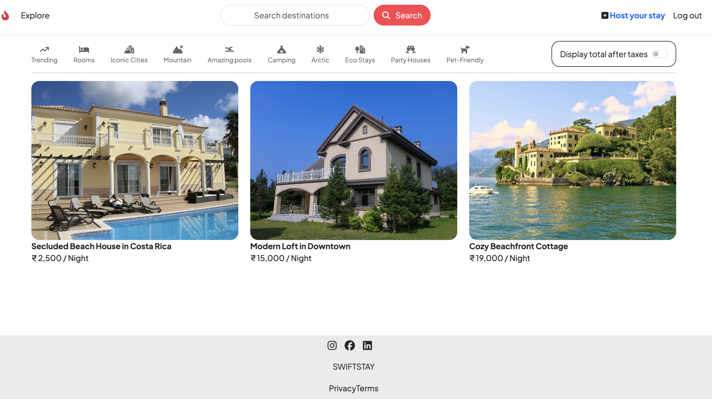

# 🏡 Holiday Home Booking System

> **Transforming Stays Into Unforgettable Experiences Effortlessly**

A full-featured web application framework tailored for property rental platforms. This project provides a scalable backend architecture with integrated middleware, cloud-based media management, and reusable views — enabling developers to build secure, user-friendly booking systems efficiently.

[🔗 View Live Demo](https://swiftstay-frn6.onrender.com)
---



## 🌟 Features

### Core Functionality
- 📝 User Authentication & Authorization (Register / Login / Logout)
- 🏠 Property Listing Management (Create / Edit / Delete)
- 💬 Reviews & Ratings system
- 🔍 Dynamic property search and filtering

### Technical Features
- 📸 Cloud-based image uploads with **Cloudinary**
- 🌙 Session-based Flash messaging
- 📊 Middleware-based server error handling
- 📑 Responsive, mobile-friendly design via **Bootstrap 5**
- 🌟 Star rating UI integration
- 💸 Tax toggle functionality for pricing breakdown
- 📃 Robust data validation for all forms

---

## 🛠️ Technologies Used

**Frontend:**  


**Backend:**  


**Cloud Services:**  


**Utilities / Tools:**  


---

## 🔑 Environment Variables

Create a `.env` file in the project root with the following keys:

```env
ATLASDB_URL=your_mongodb_connection_string
CLOUD_NAME=your_cloudinary_name
CLOUD_API_KEY=your_cloudinary_key
CLOUD_API_SECRET=your_cloudinary_secret
SECRET=your_session_secret
```
---

## 🚀 Installation

1. Clone the repository:
```bash
git clone https://github.com/AjeetKu143/Holiday-Home-Booking-System.git
cd Holiday-Home-Booking-System
npm install
nodemon app.js
```
- Access at: http://localhost:7070
---
## 🎯 Future Enhancements
- 🗺️ Google Maps property location integration

- 📩 Email notifications with NodeMailer

- 📊 Booking analytics dashboard

- 📱 PWA support for offline experience

- 💰 Payment gateway integration
